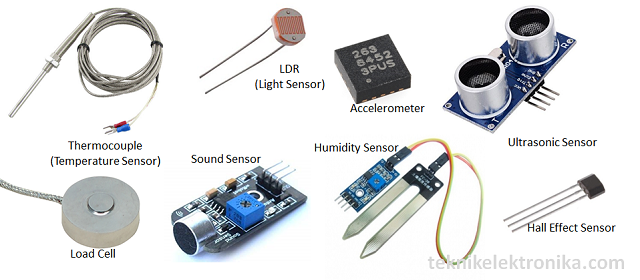
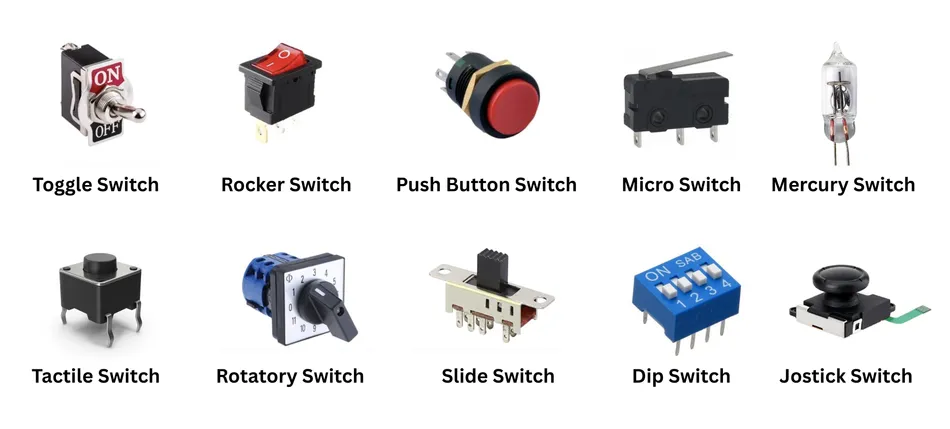

# Apa itu IoT?

IoT atau *Internet of Things* adalah konsep di mana benda-benda fisik dapat terhubung ke internet untuk mengumpulkan, mengirim, dan menerima data secara otomatis.

Dengan kata lain, IoT membuat benda sehari-hari menjadi lebih “cerdas”. Benda-benda tersebut tidak hanya digunakan secara biasa, tetapi juga bisa berkomunikasi dengan sistem lain melalui jaringan internet.

## Mengapa IoT Bisa Berkembang?

Perkembangan IoT didukung oleh beberapa hal, yaitu:
- chip komputer yang semakin kecil,
- biaya perangkat yang semakin murah,
- koneksi internet yang semakin cepat,
- serta teknologi cloud yang memudahkan penyimpanan dan pengolahan data.

Karena perkembangan tersebut, sekarang banyak perangkat di sekitar kita dapat dibuat menjadi perangkat pintar.

## Contoh Perangkat IoT

Beberapa contoh perangkat IoT dalam kehidupan sehari-hari antara lain:
- lampu pintar,
- kamera keamanan,
- smartwatch,
- mobil pintar,
- alat ukur air digital,
- penyedot debu otomatis,
- dan berbagai mesin industri.

Perangkat-perangkat tersebut dapat bekerja lebih cerdas karena mampu membaca kondisi lingkungan, mengirim data, dan merespons perintah pengguna.

## Komponen Dasar pada Perangkat IoT

Secara umum, perangkat IoT biasanya memiliki dua jenis fungsi utama:

### 1. Sensor

Sensor berfungsi untuk mengumpulkan data dari lingkungan.  
Contohnya:
- sensor suhu,
- sensor kelembapan,
- sensor gerak,
- sensor cahaya,
- sensor lokasi.

### 2. Switch atau Aktuator

Switch atau aktuator berfungsi untuk menjalankan perintah terhadap suatu objek.  
Contohnya:
- menyalakan lampu,
- membuka pintu otomatis,
- menyalakan kipas,
- mengaktifkan pompa air.

## Bagaimana IoT Mengubah Benda Biasa Menjadi Pintar?

IoT menghubungkan benda-benda fisik dengan internet. Artinya, benda yang sebelumnya hanya digunakan secara manual kini dapat:
- mengirim data,
- menerima perintah,
- merespons kondisi tertentu,
- dan bekerja secara otomatis.

Sebagai contoh, lampu rumah yang terhubung ke internet dapat dinyalakan dari smartphone. Kamera keamanan dapat mengirim notifikasi saat mendeteksi gerakan. Smartwatch dapat memantau detak jantung lalu menampilkan hasilnya ke aplikasi.

## Perkembangan Awal IoT

Gagasan menghubungkan benda dengan teknologi komputasi sebenarnya sudah ada sejak lama. Sejak tahun 1990-an, para insinyur mulai menambahkan sensor dan prosesor ke berbagai objek sehari-hari. Namun, saat itu perkembangannya masih lambat karena ukuran chip masih besar dan kurang efisien.

Salah satu teknologi awal yang banyak digunakan adalah RFID, yaitu chip berdaya rendah yang dipakai untuk melacak peralatan atau barang tertentu. Seiring waktu, ukuran chip semakin kecil, kecepatannya meningkat, dan kemampuannya menjadi lebih baik.

## Mengapa IoT Penting?

IoT penting karena memungkinkan berbagai proses dilakukan dengan lebih:
- otomatis,
- cepat,
- efisien,
- dan cerdas.

Dengan IoT, manusia tidak harus selalu memantau sesuatu secara langsung. Data dapat dikirim secara otomatis, lalu sistem dapat membantu mengambil keputusan atau menjalankan tindakan tertentu.

## Ringkasan

Secara sederhana, IoT adalah teknologi yang menghubungkan benda fisik ke internet agar benda tersebut dapat mengumpulkan data, bertukar informasi, dan bekerja lebih cerdas.

Jadi, IoT dapat dipahami sebagai gabungan dari:
- benda fisik,
- sensor atau aktuator,
- koneksi internet,
- dan pertukaran data secara otomatis.